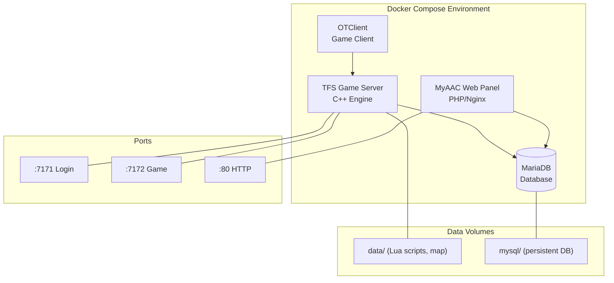

# Adventure OTS — Technology Requirements

> **SDLC Stage 1: Research & Analysis**
> Project: *Adventure OTS (OTS_Poland)* — A private Tibia Open Server for neighbourhood friends

---

## 1. What is a Tibia OTS?

Tibia is a **2D tile-based MMORPG** launched in 1997 by CipSoft. An **Open Tibia Server (OTS)** is a community-built server emulator that replicates the server-side functionality of the original game, allowing you to host your own game world with custom rules, maps, creatures, and quests.

### Core Tibia Game Mechanics (what we need to emulate)

| System | Description |
|--------|-------------|
| **World** | 2D tile-based map with X, Y, Z coordinates (floors 0–15, ground = floor 7) |
| **Vocations** | Knight (melee tank), Paladin (ranged), Sorcerer (offensive magic), Druid (healing/support) |
| **Creatures** | AI-controlled monsters with unique stats, loot tables, resistances, spawn areas |
| **Spells** | Instant spells + Rune spells, vocation-specific, mana cost, level requirements, cooldowns |
| **Items** | Weapons, armor, consumables, tools, containers, quest items — equippable in 10 inventory slots |
| **Combat** | PvE + PvP, melee/ranged/magic damage types, elemental resistances, death penalties |
| **NPCs** | Text-based dialogue, merchants, quest givers |
| **Quests** | Multi-step adventures, key/door systems, boss encounters, rewards |
| **Housing** | Player-owned houses, furniture, storage |
| **Economy** | Gold-based, NPC shops, player-to-player trading |

---

## 2. Technology Stack

### 2.1 Server Engine — C++

The game server is the heart of the OTS and is written in **C++** for maximum performance.

```
Role: Game engine — handles all real-time game logic
Why C++: Performance-critical (physics, combat calculations, concurrent players)
```

**Key responsibilities:**
- TCP/IP network layer (accepting client connections)
- Game loop (tick-based world updates, ~50ms per tick)
- Player session management
- Creature AI and pathfinding (A* algorithm)
- Combat system (damage formulas, PvP rules)
- Map loading and tile management
- Item and inventory systems
- Spell and effect execution

**Recommended base:** [The Forgotten Server (TFS)](https://github.com/otland/forgottenserver) or [Canary](https://github.com/opentibiabr/canary)

| Engine | Protocol | Status | Best for |
|--------|----------|--------|----------|
| **TFS 1.4.2** | 10.98 | Stable, well-documented | Learning, small servers |
| **TFS 1.5** | 12.x | Active development | Modern protocol support |
| **Canary** | 13.x (multi-protocol) | Active, feature-rich | Production, multi-version |

> **Recommendation for our project:** Start with **TFS 1.4.2** (protocol 10.98) — most stable, best documented, largest community support base.

---

### 2.2 Scripting Layer — Lua

All game content (quests, spells, creature behavior, events) is scripted in **Lua**.

```
Role: Content scripting — defines game rules, quests, spells, creature AI
Why Lua: Lightweight, embeddable, hot-reloadable (no server recompile needed)
```

**What Lua scripts control:**
- Creature scripts (spawn, loot, abilities, aggression)
- Spell definitions (damage, area, effects, requirements)
- NPC dialogues and shops
- Quest logic and progression
- Global events (raids, scheduled events)
- Action scripts (using items, opening chests)
- Movement scripts (tile triggers, teleports)
- Talk actions (chat commands)

**Example structure:**
```
data/
├── creaturescripts/   # On login, death, kill events
├── scripts/           # Modern Lua script system
├── spells/            # Spell definitions
├── npc/               # NPC behavior and dialogue
├── movements/         # Tile-triggered scripts
├── actions/           # Item use scripts
├── globalevents/      # Server-wide events
└── talkactions/       # Chat command handlers
```

---

### 2.3 Database — MySQL / MariaDB

All persistent game data is stored in a relational database.

```
Role: Persistent storage for accounts, characters, world state
Why MySQL/MariaDB: Industry standard for OTS, excellent tooling, TFS native support
```

**Core tables:**
| Table | Purpose |
|-------|---------|
| `accounts` | Login credentials, premium status, email |
| `players` | Character data (name, level, vocation, stats, position) |
| `player_items` | Inventory and equipment |
| `player_storage` | Quest progress, variables, flags |
| `player_spells` | Learned spells |
| `player_deaths` | Death log |
| `houses` | House ownership, rent, contents |
| `guilds` | Guild system data |
| `market_offers` | Player market trades |
| `tiles` | Dynamic tile state (house items, etc.) |

**Alternative:** SQLite (simpler, file-based — good for development/testing)

---

### 2.4 Game Client — OTClient

Players need a client application to connect to the server and play the game.

```
Role: Renders the game world, handles user input, communicates with server
Technology: C++17, Lua, OpenGL ES 2.0, OpenAL
```

**Client options:**

| Client | Tech | Platforms | Best for |
|--------|------|-----------|----------|
| **OTClient V8** | C++17, Lua, OpenGL | Windows, Linux, Android | Clean, ready-to-use, highly optimized |
| **Mehah OTClient** | C++17, Lua, OpenGL | Windows, Linux | Modern protocols (12.x, 13.x) |
| **Classic Tibia Client** | Proprietary | Windows | Nostalgia, specific protocol versions |

> **Recommendation:** **OTClient V8** — cross-platform, customizable UI via Lua, good compatibility with TFS 1.4.2 (protocol 10.98).

**Client requires:**
- `Tibia.dat` — item/creature appearance data
- `Tibia.spr` — sprite sheet (graphics)
- Both files must match the server protocol version

---

### 2.5 Web Panel (AAC) — PHP / Alternatives

An Account Manager / Community website for player registration and server info.

```
Role: Web interface for account creation, character management, server status
Traditional: PHP + Apache/Nginx
```

**Popular AAC (Automatic Account Creator) options:**
| AAC | Language | Notes |
|-----|----------|-------|
| **Gesior AAC** | PHP | Classic, feature-rich, most popular |
| **MyAAC** | PHP | Modern, modular, actively maintained |
| **Custom** | Python/Node.js | If you want to build from scratch |

> **Recommendation for friends server:** Start with **MyAAC** or build a minimal Python/Flask panel later.

---

### 2.6 Network Protocol

```
Transport: TCP/IP
Ports: 7171 (game/login), 7172 (game server)
Protocol: Custom binary protocol (Tibia-specific)
Encryption: RSA + XTEA
```

**Connection flow:**
```
Client → Login Server (port 7171)
  ├── RSA handshake (key exchange)
  ├── XTEA encryption established
  ├── Account authentication
  └── Character list returned

Client → Game Server (port 7172)
  ├── Character selection
  ├── World data streamed
  └── Real-time game communication (binary packets)
```

---

## 3. Development Tools

### 3.1 Map Editor — Remere's Map Editor (RME)

| Property | Value |
|----------|-------|
| **Purpose** | Create and edit game maps (.otbm format) |
| **Platform** | Windows, Linux |
| **Source** | [GitHub](https://github.com/hampusborgos/rme) |
| **Requires** | Tibia.dat + Tibia.spr matching target protocol |

### 3.2 Item Editor — OTItemEditor

| Property | Value |
|----------|-------|
| **Purpose** | Manage item properties (OTB files) |
| **Reads** | Tibia.dat, Tibia.spr |
| **Outputs** | items.otb (server item data) |

### 3.3 Object Builder

| Property | Value |
|----------|-------|
| **Purpose** | Edit .dat and .spr files (sprites and item appearances) |
| **Use** | Custom items, outfits, effects |

### 3.4 IDE / Code Editor

| Tool | Use |
|------|-----|
| **VS Code** | Lua scripting, configuration files |
| **CLion / VS** | C++ server engine development |
| **DBeaver / HeidiSQL** | Database management & queries |

---

## 4. Infrastructure & Deployment

### 4.1 Hardware Requirements (for ~5-10 friends)

| Resource | Minimum | Recommended |
|----------|---------|-------------|
| **CPU** | 2 cores (any modern CPU) | 4 cores |
| **RAM** | 2 GB | 4 GB |
| **Storage** | 10 GB SSD | 20 GB SSD |
| **Network** | 10 Mbps | 100 Mbps |

> A spare desktop, Raspberry Pi 4 (8GB), or cheap VPS ($5-10/month) is sufficient for a friends-only server.

### 4.2 Operating System

| OS | Suitability |
|----|-------------|
| **Ubuntu 22.04/24.04 LTS** | ★★★★★ Best choice, most guides target Ubuntu |
| **Debian** | ★★★★ Stable alternative |
| **Windows** | ★★★ Possible but less common for production |

> **Our setup:** Ubuntu on WSL2 (development) → Ubuntu VPS or local machine (production)

### 4.3 Deployment Stack



### 4.4 Docker Compose Architecture

```yaml
# Conceptual docker-compose.yml
services:
  gameserver:
    build: ./server
    ports:
      - "7171:7171"   # Login server
      - "7172:7172"   # Game server
    volumes:
      - ./data:/srv/data         # Lua scripts, map files
      - ./config:/srv/config     # Server configuration
    depends_on:
      - database

  database:
    image: mariadb:10.11
    environment:
      MYSQL_ROOT_PASSWORD: ${DB_ROOT_PASSWORD}
      MYSQL_DATABASE: forgottenserver
      MYSQL_USER: otserver
      MYSQL_PASSWORD: ${DB_PASSWORD}
    volumes:
      - db_data:/var/lib/mysql

  webpanel:
    build: ./web
    ports:
      - "80:80"
    depends_on:
      - database

volumes:
  db_data:
```

### 4.5 Firewall Requirements

| Port | Service | Protocol |
|------|---------|----------|
| 7171 | Login server | TCP |
| 7172 | Game server | TCP |
| 80 | Web panel (HTTP) | TCP |
| 443 | Web panel (HTTPS) | TCP (optional) |

---

## 5. File & Data Formats

| Format | Purpose | Tool |
|--------|---------|------|
| `.otbm` | Map data (tiles, items, spawns) | Remere's Map Editor |
| `.otb` | Item definitions (server-side) | OTItemEditor |
| `.dat` | Item/creature appearances (client-side) | Object Builder |
| `.spr` | Sprite graphics (client-side) | Object Builder |
| `.xml` | Monsters, NPCs, items config | Text editor |
| `.lua` | Game scripts (spells, quests, events) | VS Code |
| `.sql` | Database schema and migrations | DBeaver |

---

## 6. Summary — Complete Stack at a Glance

```
┌────────────────────────────────────────────────────────┐
│                    ADVENTURE OTS STACK                   │
├────────────────────────────────────────────────────────┤
│                                                        │
│  CLIENT SIDE                                           │
│  ├── OTClient V8 (C++17, Lua, OpenGL)                 │
│  ├── Tibia.dat + Tibia.spr (protocol 10.98)           │
│  └── Custom UI modules (Lua)                          │
│                                                        │
│  SERVER SIDE                                           │
│  ├── TFS 1.4.2 (C++ game engine)                      │
│  ├── Lua 5.2+ (content scripting)                     │
│  ├── MariaDB 10.11 (persistent storage)               │
│  └── MyAAC (PHP web panel)                            │
│                                                        │
│  DEVELOPMENT TOOLS                                     │
│  ├── Remere's Map Editor (map creation)               │
│  ├── OTItemEditor (item management)                   │
│  ├── Object Builder (sprites/appearances)             │
│  ├── VS Code (Lua/config editing)                     │
│  └── Docker + Docker Compose (deployment)             │
│                                                        │
│  INFRASTRUCTURE                                        │
│  ├── Ubuntu 22.04+ LTS                                │
│  ├── Docker & Docker Compose                          │
│  ├── Ports: 7171 (login), 7172 (game), 80 (web)      │
│  └── Hardware: 2+ cores, 4GB RAM, 10GB SSD            │
│                                                        │
│  NETWORKING                                            │
│  ├── TCP/IP transport                                 │
│  ├── Custom binary protocol                           │
│  └── RSA + XTEA encryption                            │
│                                                        │
└────────────────────────────────────────────────────────┘
```

---

## 7. Key Resources & References

| Resource | URL | Description |
|----------|-----|-------------|
| **OTLand Forum** | otland.net | Primary community hub for OTS development |
| **TFS GitHub** | github.com/otland/forgottenserver | The Forgotten Server source code |
| **Canary GitHub** | github.com/opentibiabr/canary | Modern OTS engine |
| **OTClient V8** | github.com/nickywan123/otclientv8 | Game client |
| **RME GitHub** | github.com/hampusborgos/rme | Map editor |
| **TibiaMaps.io** | tibiamaps.io | Map data and coordinates reference |
| **TibiaWiki** | tibia.fandom.com | Complete game mechanics wiki |

---

> **Next SDLC Stage:** System Design & Architecture — define modules, database schema, API contracts, and create the project board.
