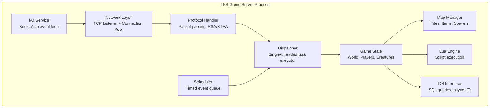
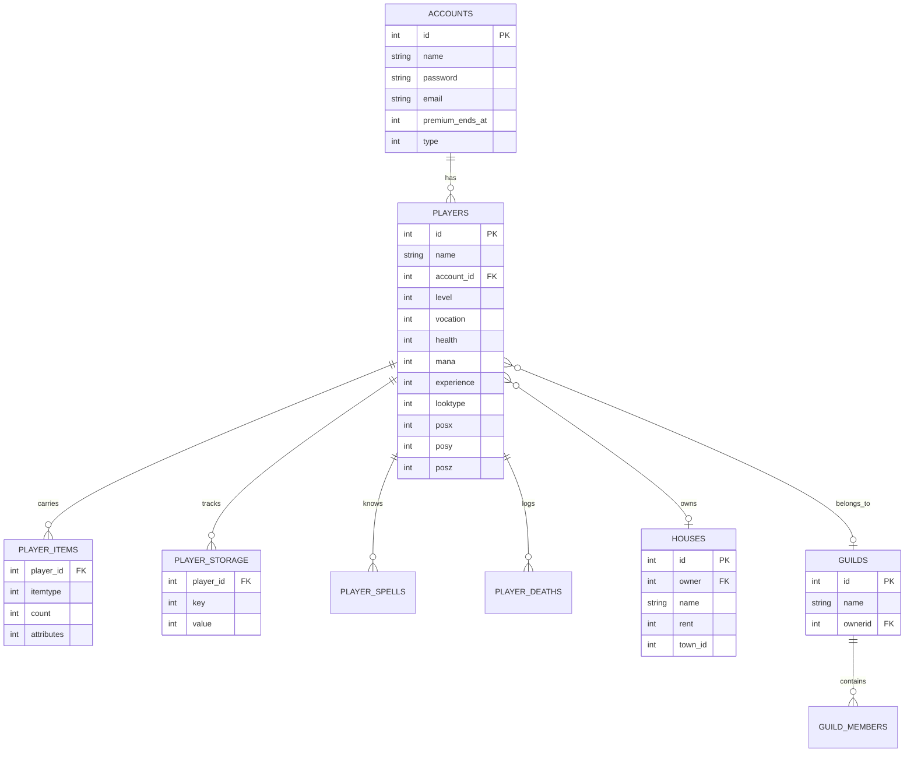
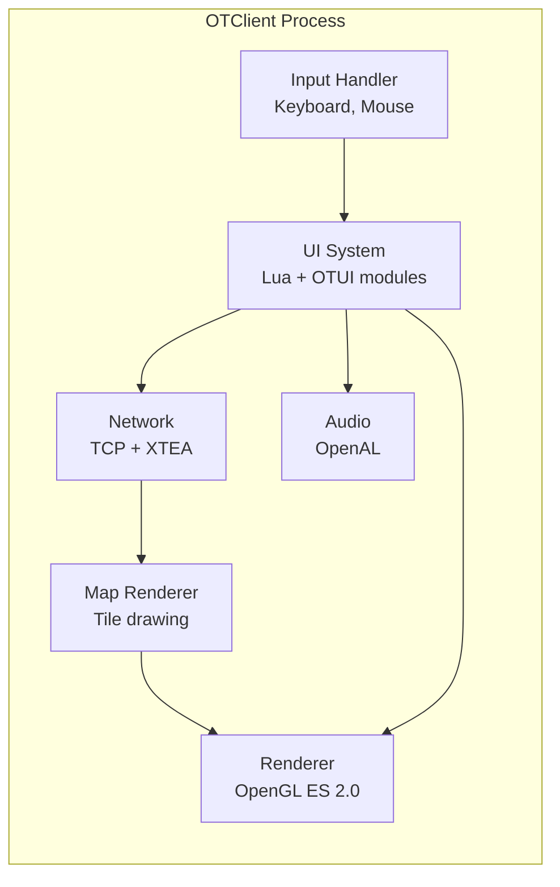
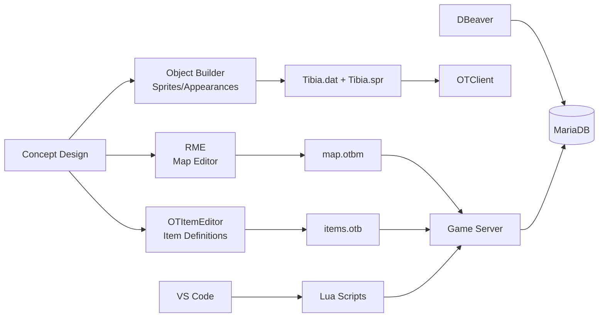
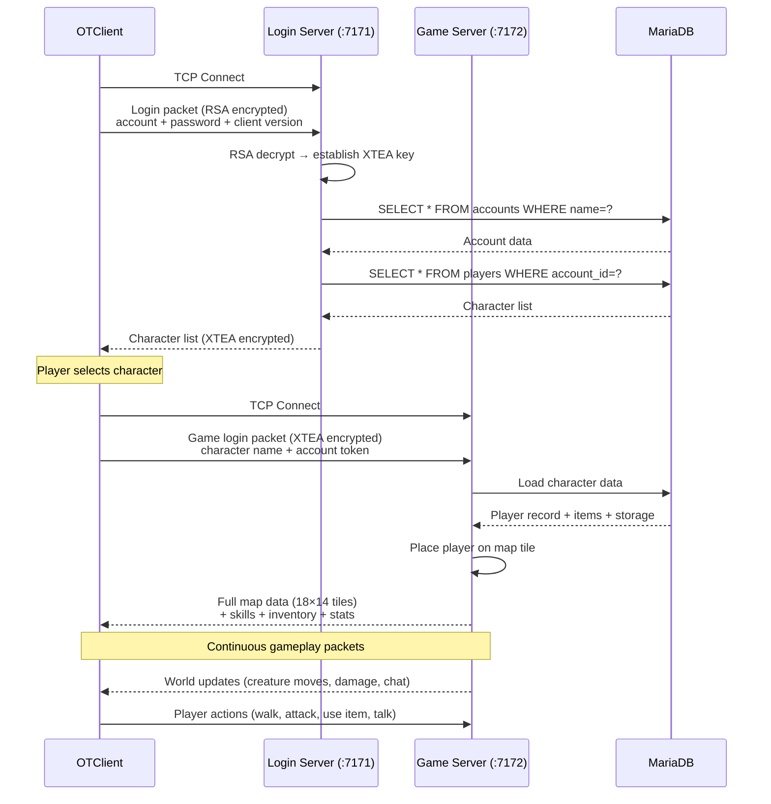
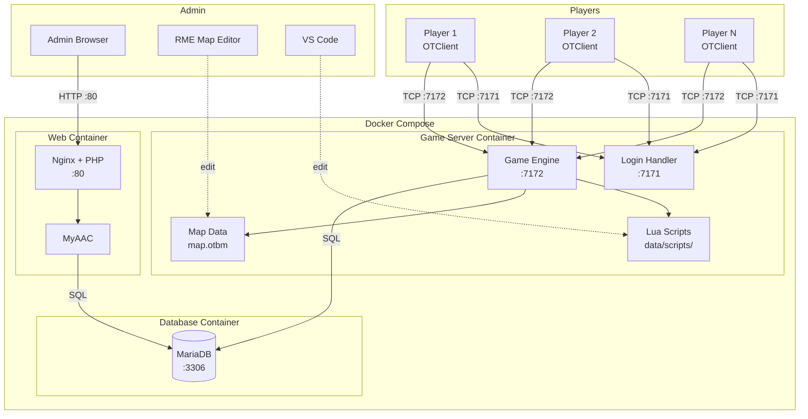

# Adventure OTS — System Architecture

> **SDLC Stage 1: Research & Analysis**
> Document 02 — Architecture overview of all OTS system components

---

## 1. High-Level System Overview

An OTS consists of **five main components** that work together to deliver the full game experience:

```
┌──────────────────────────────────────────────────────────────┐
│                     ADVENTURE OTS SYSTEM                      │
│                                                              │
│  ┌────────────┐     TCP/IP      ┌──────────────────────┐    │
│  │  OTClient  │◄───────────────►│   Game Server (TFS)  │    │
│  │  (Player)  │   ports 7171    │   C++ Engine         │    │
│  └────────────┘    / 7172       │                      │    │
│                                 │  ┌────────────────┐  │    │
│                                 │  │  Lua Scripting │  │    │
│                                 │  │  Engine        │  │    │
│                                 │  └────────────────┘  │    │
│                                 │                      │    │
│                                 │  ┌────────────────┐  │    │
│                                 │  │  Map + Data    │  │    │
│                                 │  │  (.otbm, .xml) │  │    │
│                                 │  └────────────────┘  │    │
│                                 └──────────┬───────────┘    │
│                                            │ SQL            │
│  ┌────────────┐    HTTP/SQL     ┌──────────▼───────────┐    │
│  │  Website   │◄───────────────►│   MariaDB Database   │    │
│  │  (AAC)     │    port 80      │                      │    │
│  │  PHP/Nginx │                 │  accounts, players,  │    │
│  └────────────┘                 │  items, houses, ...  │    │
│                                 └──────────────────────┘    │
│                                                              │
│  ┌────────────────────────────────────────────────────────┐  │
│  │  Dev Tools: RME (map editor) · OTItemEditor · VS Code │  │
│  └────────────────────────────────────────────────────────┘  │
└──────────────────────────────────────────────────────────────┘
```

### Component Summary

| # | Component | Role | Technology |
|---|-----------|------|------------|
| 1 | **Game Server** | Core engine — all game logic, networking, player sessions | C++ (TFS) |
| 2 | **Lua Scripts + Data** | Game content — quests, spells, NPCs, creatures, events | Lua 5.2+ |
| 3 | **Database** | Persistent storage — accounts, characters, world state | MariaDB |
| 4 | **Game Client** | Player interface — renders world, handles input | OTClient (C++) |
| 5 | **Website (AAC)** | Account management, server info, community features | PHP + Nginx |
| 6 | **Dev Tools** | Map creation, item editing, sprite editing | RME, OTItemEditor |

---

## 2. Component 1 — Game Server Engine (TFS)

The server engine is the brain of the entire system. It is a **single C++ process** that manages all game logic in a tick-based loop.

### 2.1 Internal Subsystems



### 2.2 Subsystem Descriptions

| Subsystem | Responsibility | Key Details |
|-----------|---------------|-------------|
| **I/O Service** | Async networking via Boost.Asio | Non-blocking I/O, event-driven |
| **Network Layer** | Accept TCP connections, manage connection pool | Listens on ports 7171 (login) and 7172 (game) |
| **Protocol Handler** | Parse/serialize binary packets | RSA key exchange → XTEA encryption → Adler32 checksum |
| **Dispatcher** | Execute game logic tasks sequentially | **Single-threaded** — prevents data races on game state |
| **Scheduler** | Queue delayed/periodic tasks | Spell cooldowns, regeneration ticks, save intervals |
| **Game State** | Central world state: all players, creatures, items | Updated every tick by the dispatcher |
| **Map Manager** | Load .otbm map, manage tile grid, spawns | 2D tile grid with Z-levels (floors 0–15) |
| **Lua Engine** | Execute data/scripts/ for game content | Embedded Lua interpreter, event-driven callbacks |
| **DB Interface** | Async SQL queries for persistence | Player save/load, house state, guild data |

### 2.3 Scheduler-Dispatcher Pattern

This is the most important architectural pattern in TFS:

```
                    ┌─────────────────────────────┐
                    │        SCHEDULER            │
                    │  (priority queue by time)    │
                    │                             │
                    │  [t=100ms] regenerate HP    │
                    │  [t=200ms] creature AI      │
                    │  [t=500ms] check spawns     │
                    │  [t=1000ms] auto-save       │
                    └─────────────┬───────────────┘
                                  │ push when due
                    ┌─────────────▼───────────────┐
                    │        DISPATCHER           │
                    │  (single-threaded FIFO)     │
                    │                             │
                    │  • Processes one task at    │
                    │    a time                   │
                    │  • Modifies game state      │
                    │    safely (no mutex needed)  │
                    │  • Network I/O is async     │
                    │    on separate threads       │
                    └─────────────────────────────┘
```

**Why single-threaded dispatcher?** Game state (player positions, HP, items) must be consistent. A single dispatcher thread means no two tasks modify state simultaneously → no data races, no locks needed.

### 2.4 Game Loop (Tick-Based)

Each "tick" (~50ms) the dispatcher processes:

```
1. Read incoming player packets (movement, attack, chat, use item)
2. Execute scheduled events (HP regen, mana regen, creature AI)
3. Update game state (apply damage, move creatures, check deaths)
4. Broadcast changes to affected clients (within visible area: 18×14 tiles)
5. Clean up (remove dead creatures, expired items)
```

**Key timing constants:**
| Event | Interval |
|-------|----------|
| Game tick | ~50ms (20 ticks/sec) |
| Player walk | 200–1000ms (depends on speed) |
| HP/Mana regeneration | 1000ms |
| Creature AI think | 1000ms |
| Auto-save | 300,000ms (5 min) |

---

## 3. Component 2 — Game Data & Lua Scripts

The game server loads two categories of data at startup:

### 3.1 Static Data (XML/OTB files)

```
data/
├── items/
│   ├── items.otb          # Item definitions (IDs, flags, types)
│   └── items.xml          # Item attributes (name, weight, armor)
├── monster/
│   ├── monsters.xml       # Monster index
│   └── [name].xml         # Individual monster (HP, loot, abilities)
├── npc/
│   └── [name].xml         # NPC definitions
├── world/
│   ├── map.otbm           # Complete game map
│   ├── spawns.xml         # Monster/NPC spawn points
│   └── houses.xml         # House definitions
└── XML/
    ├── vocations.xml       # Vocation stats & formulas
    ├── groups.xml          # Permission groups (admin, GM, player)
    ├── stages.xml          # Experience rate stages
    └── outfits.xml         # Character outfits
```

### 3.2 Dynamic Scripts (Lua)

```
data/scripts/
├── actions/              # Item use (open chest, eat food, use rope)
├── creaturescripts/      # On-login, on-death, on-kill events
├── globalevents/         # Server start, shutdown, timed world events
├── movements/            # Step-on tile events (teleports, traps)
├── spells/               # Spell effects, formulas, area-of-effect
├── talkactions/          # Chat commands (/info, !serverinfo)
├── monsters/             # Monster ability scripts
└── quests/               # Quest chains and logic (custom)
```

**Lua ↔ Engine interface:** The C++ engine exposes functions to Lua (e.g., `doPlayerAddItem()`, `getCreatureHealth()`, `doAreaCombat()`). Lua scripts call these to implement game content without touching C++ code.

---

## 4. Component 3 — Database (MariaDB)

### 4.1 Entity-Relationship Overview



### 4.2 Data Flow Patterns

| Operation | Direction | When |
|-----------|-----------|------|
| **Load account** | DB → Server | Player login |
| **Load character** | DB → Server | Character enters game |
| **Save character** | Server → DB | Auto-save (5min), logout, server shutdown |
| **Save house** | Server → DB | House item change, server save |
| **Read highscores** | DB → Website | Page load on AAC |
| **Create account** | Website → DB | Player registration |

---

## 5. Component 4 — Game Client (OTClient)

### 5.1 Client Architecture



### 5.2 Client Responsibilities

| System | What it does |
|--------|-------------|
| **Network** | Connect to server, encrypt/decrypt packets (XTEA), keep-alive |
| **Map Renderer** | Draw visible 15×11 tile area (server sends 18×14 for smooth scrolling) |
| **Creature Renderer** | Draw player/NPC/monster sprites with animations |
| **UI System** | HUD, inventory, chat, skills panel — all customizable via Lua/OTUI |
| **Input** | Translate keyboard/mouse to game actions (walk, attack, use) |
| **Audio** | Sound effects and ambient audio |
| **Minimap** | Auto-generated exploration map |

### 5.3 Required Data Files

| File | Source | Purpose |
|------|--------|---------|
| `Tibia.dat` | Protocol-version specific | Item/creature appearance definitions |
| `Tibia.spr` | Protocol-version specific | Sprite graphics (pixel art) |
| RSA public key | Compiled into client | Must match server's private key |

---

## 6. Component 5 — Website (AAC)

### 6.1 Architecture

```
┌──────────────┐     HTTP      ┌───────────┐     SQL      ┌──────────┐
│   Browser    │◄─────────────►│  Nginx    │◄────────────►│ MariaDB  │
│   (Player)   │               │  + PHP    │              │ (shared  │
└──────────────┘               │  (MyAAC)  │              │  with    │
                               └───────────┘              │  TFS)    │
                                                          └──────────┘
```

> **Critical:** The AAC and the game server share the **same database**. This is how the website can show online players, highscores, and manage accounts that the game server uses.

### 6.2 AAC Feature Matrix

| Feature | Gesior | MyAAC | Znote |
|---------|--------|-------|-------|
| Account registration | ✅ | ✅ | ✅ |
| Character creation | ✅ | ✅ | ✅ |
| Password recovery | ⚠️ | ✅ | ✅ |
| Admin panel | ⚠️ | ✅ | ✅ |
| Plugin system | ❌ | ✅ | ✅ |
| 2FA support | ❌ | ❌ | ✅ |
| Twig templates | ❌ | ✅ | ❌ |
| Caching engine | ❌ | ✅ | ❌ |
| TFS 1.4 compat | ✅ | ✅ | ✅ |
| Clean codebase | ⚠️ | ✅ | ✅ |

> **Recommendation for our server:** **MyAAC** — best balance of features, modern codebase, plugin system, and TFS compatibility.

---

## 7. Component 6 — Development Tools

### 7.1 Tool Pipeline



---

## 8. Network Protocol Deep Dive

### 8.1 Login Sequence



### 8.2 Packet Structure

```
┌────────┬────────────┬───────────────────────────────────┐
│ Length  │ Checksum   │         Encrypted Payload         │
│ 2 bytes│ 4 bytes    │         (XTEA)                    │
│        │ (Adler32)  │                                   │
├────────┴────────────┴───────────────────────────────────┤
│                                                         │
│  After XTEA decryption:                                 │
│  ┌──────────┬──────────────────────────────────┐       │
│  │ Opcode   │           Data Payload           │       │
│  │ 1 byte   │           Variable length        │       │
│  └──────────┴──────────────────────────────────┘       │
│                                                         │
│  Example opcodes:                                       │
│    0x64 = Full map description                          │
│    0x6C = Add creature to tile                          │
│    0x6D = Creature moved                                │
│    0xA1 = Player stats update                           │
│    0xAA = Chat message                                  │
└─────────────────────────────────────────────────────────┘
```

### 8.3 Encryption Layers

| Layer | Algorithm | Purpose |
|-------|-----------|---------|
| **1. RSA** | 1024-bit RSA | Initial key exchange during login |
| **2. XTEA** | 128-bit symmetric block cipher | All gameplay packets (fast) |
| **3. Adler32** | Checksum | Packet integrity verification |
| **4. Zlib** | Compression (optional) | Reduce bandwidth for large packets |

---

## 9. Data Flow — Complete Picture



---

## 10. Deployment Architecture

### 10.1 Docker Compose Services

| Service | Image / Build | Ports | Volumes | Depends On |
|---------|--------------|-------|---------|------------|
| `gameserver` | Build from TFS source | 7171, 7172 | `./data`, `./config` | database |
| `database` | `mariadb:10.11` | 3306 (internal) | `db_data` (named) | — |
| `webpanel` | Build from MyAAC | 80 | `./web` | database |

### 10.2 Environment Variables

```env
# .env file
DB_ROOT_PASSWORD=<secure_root_pass>
DB_NAME=forgottenserver
DB_USER=otserver
DB_PASSWORD=<secure_pass>
SERVER_NAME=Adventure OTS
SERVER_IP=<your_ip_or_domain>
SERVER_PORT=7172
LOGIN_PORT=7171
```

### 10.3 Network Topology (Friends Setup)

```
   ┌──────────────────────────────────┐
   │  Host Machine (Ubuntu / WSL2)    │
   │                                  │
   │  Docker Compose                  │
   │  ┌─────────┐ ┌──────┐ ┌─────┐  │
   │  │ TFS     │ │Maria │ │MyAAC│  │
   │  │ :7171   │ │DB    │ │ :80 │  │
   │  │ :7172   │ │:3306 │ │     │  │
   │  └─────────┘ └──────┘ └─────┘  │
   │       ▲                   ▲     │
   └───────┼───────────────────┼─────┘
           │                   │
    ─── LAN / Internet ────────┤
           │                   │
     ┌─────┴─────┐       ┌────┴────┐
     │ Friend's  │       │Friend's │
     │ OTClient  │       │Browser  │
     └───────────┘       └─────────┘
```

---

## 11. Game Mechanics Architecture

### 11.1 Combat System

```
Damage Calculation Pipeline:
┌──────────┐    ┌──────────────┐    ┌────────────┐    ┌──────────┐
│ Attacker │───►│ Attack Value │───►│ Mitigation │───►│ Final    │
│ Stats    │    │ Formula      │    │ Checks     │    │ Damage   │
└──────────┘    └──────────────┘    └────────────┘    └──────────┘

Attack Value (example — melee):
  Offensive: (WeaponAtk + Skill) / 2 + BaseBonus
  Balanced:  (WeaponAtk + Skill×0.75) / 2 + BaseBonus
  Defensive: (WeaponAtk + Skill×0.5) / 2 + BaseBonus

Mitigation:
  1. Shielding → blocks physical damage (random 0–100%)
  2. Armor → reduces physical damage by flat amount
  3. Elemental resistance → % reduction for magic types
  4. Mana Shield → redirects HP damage to MP (if active)
```

### 11.2 Pathfinding (A* Algorithm)

The server uses **A\* pathfinding** for creature movement and server-side player auto-walk:

| Property | Value |
|----------|-------|
| Algorithm | A* with Manhattan distance heuristic |
| Grid | 2D tile grid per Z-level |
| Tile cost | Variable (terrain friction affects speed) |
| Max path length | 128 tiles (creatures), unlimited (players) |
| Update rate | Every 1000ms for creature AI |

### 11.3 Visible Area & Updates

```
Server sends:    18 × 14 tiles   (buffer zone)
Client renders:  15 × 11 tiles   (visible screen)
                  ─────────────
                  3-tile hidden  buffer around edges
                  for smooth scrolling
```

---

## 12. Architecture Summary

```
┌──────────────────── ADVENTURE OTS ARCHITECTURE ──────────────────────┐
│                                                                       │
│  [OTClient] ◄──TCP 7171/7172──► [TFS Game Server]                    │
│       │                              │   │   │                        │
│       │ renders                      │   │   │                        │
│       ▼                              │   │   │                        │
│  Tibia.dat/spr                       │   │   │                        │
│                                      │   │   │                        │
│  [Lua Scripts] ◄─ embedded ──────────┘   │   │                        │
│  (spells, quests, NPCs, events)          │   │                        │
│                                          │   │                        │
│  [Map Data .otbm] ◄─ loaded at start ───┘   │                        │
│                                              │                        │
│  [MariaDB] ◄──────── SQL queries ────────────┘                        │
│       ▲                                                               │
│       │                                                               │
│       └──── SQL ──── [MyAAC Website] ◄──HTTP 80──► [Player Browser]  │
│                                                                       │
│  Dev Tools:  RME → .otbm  ·  OTItemEditor → .otb  ·  VS Code → .lua │
└───────────────────────────────────────────────────────────────────────┘
```

---

> **Next step:** System Design — translate this architecture into concrete implementation plans with database schema SQL, Dockerfile blueprints, and module-by-module build order.
