# Adventure OTS — Requirements Identification (High-Level)

> **SDLC Stage 1: Research & Analysis**
> Document 03 — Functional & Non-Functional Requirements

---

## Part A: Functional Requirements

> Functional requirements define **what the system must do** — the features, behaviors, and capabilities that players and administrators interact with.

---

### FR-01 Account Management

| ID | Requirement | Priority | Component |
|----|-------------|----------|-----------|
| FR-01.1 | Players can register a new account (username, password, email) | Must | Website |
| FR-01.2 | Players can log in with account credentials | Must | Server + Client |
| FR-01.3 | Players can change password and email | Must | Website |
| FR-01.4 | Players can recover lost account via email | Should | Website |
| FR-01.5 | System enforces password complexity (min 6 chars) | Must | Website + Server |
| FR-01.6 | System prevents duplicate account names | Must | Website + DB |
| FR-01.7 | Password stored as salted hash (SHA-256 minimum) | Must | Website + DB |
| FR-01.8 | Admin can ban/suspend accounts | Must | Website Admin |
| FR-01.9 | System supports premium account status with extended features | Could | Server + DB |

---

### FR-02 Character Management

| ID | Requirement | Priority | Component |
|----|-------------|----------|-----------|
| FR-02.1 | Each account can create up to 5 characters | Must | Website + DB |
| FR-02.2 | Player selects character name, sex, and starting town | Must | Website |
| FR-02.3 | Player chooses vocation at level 8 (Knight, Paladin, Sorcerer, Druid) | Must | Server |
| FR-02.4 | Player can delete characters (with cooldown/delay) | Should | Website |
| FR-02.5 | Character state persists across sessions (level, items, position) | Must | Server + DB |
| FR-02.6 | System displays character info publicly (highscores, profile) | Should | Website |

---

### FR-03 User Login & Session

| ID | Requirement | Priority | Component |
|----|-------------|----------|-----------|
| FR-03.1 | Client authenticates via RSA-encrypted login packet | Must | Client + Server |
| FR-03.2 | Server returns character list after authentication | Must | Server |
| FR-03.3 | Player selects character and enters game world | Must | Client + Server |
| FR-03.4 | Server manages active sessions (one character per account online) | Must | Server |
| FR-03.5 | Auto-logout on disconnect (with 60-sec grace period for reconnect) | Must | Server |
| FR-03.6 | System saves character state on logout and periodic auto-saves | Must | Server + DB |

---

### FR-04 Game World & Map

| ID | Requirement | Priority | Component |
|----|-------------|----------|-----------|
| FR-04.1 | Server loads and serves a 2D tile-based map (X, Y, Z coordinates) | Must | Server |
| FR-04.2 | Map supports 16 floor levels (0–15, ground = floor 7) | Must | Server |
| FR-04.3 | Client renders visible area (15×11 tiles, server sends 18×14 buffer) | Must | Client |
| FR-04.4 | Map contains towns, dungeons, hunting grounds, quest areas | Must | Map Data |
| FR-04.5 | Tiles have properties: walkable, blockable, teleport, damage zones | Must | Server |
| FR-04.6 | Day/night cycle affects in-game lighting | Should | Server |
| FR-04.7 | Minimap auto-generated as player explores | Should | Client |

---

### FR-05 Movement & Pathfinding

| ID | Requirement | Priority | Component |
|----|-------------|----------|-----------|
| FR-05.1 | Player can walk in 8 directions (N, S, E, W, NE, NW, SE, SW) | Must | Server + Client |
| FR-05.2 | Click-to-walk auto-path using A* pathfinding | Must | Client + Server |
| FR-05.3 | Movement speed varies by character level, equipment, and buffs | Must | Server |
| FR-05.4 | Tiles have friction values affecting walk speed | Should | Server |
| FR-05.5 | Stairs, ladders, and ramps connect floor levels | Must | Server + Map |
| FR-05.6 | Teleports move players between distant positions | Must | Server (Lua) |

---

### FR-06 Combat System

| ID | Requirement | Priority | Component |
|----|-------------|----------|-----------|
| FR-06.1 | Players can attack creatures and other players | Must | Server |
| FR-06.2 | Three combat stances: Offensive, Balanced, Defensive | Must | Server + Client |
| FR-06.3 | Damage types: Physical, Fire, Ice, Earth, Energy, Holy, Death, Drown | Must | Server |
| FR-06.4 | Damage formulas consider weapon attack, skill, level, and stance | Must | Server |
| FR-06.5 | Defense considers shielding skill, armor value, elemental resistance | Must | Server |
| FR-06.6 | Death causes experience loss and potential item drop | Must | Server |
| FR-06.7 | PvP rules configurable (Open PvP, Optional PvP, Hardcore) | Should | Server Config |
| FR-06.8 | Skull system marks aggressive players (white, red, black skull) | Should | Server |
| FR-06.9 | Protection zone prevents combat in safe areas (temples, depots) | Must | Server |

---

### FR-07 Creatures & AI

| ID | Requirement | Priority | Component |
|----|-------------|----------|-----------|
| FR-07.1 | Creatures spawn at defined points on the map | Must | Server |
| FR-07.2 | Each creature has HP, attack, defense, speed, loot table | Must | Data (XML) |
| FR-07.3 | Creature AI: chase player, attack, flee at low HP, use abilities | Must | Server + Lua |
| FR-07.4 | Creatures respawn after death (configurable timer) | Must | Server |
| FR-07.5 | Loot drops from creature corpse, visible to killer | Must | Server |
| FR-07.6 | Boss creatures with unique mechanics and rare loot | Should | Lua Scripts |
| FR-07.7 | Creature pathfinding via A* algorithm | Must | Server (C++) |

---

### FR-08 Spells & Magic System

| ID | Requirement | Priority | Component |
|----|-------------|----------|-----------|
| FR-08.1 | Players cast spells via typed incantation or hotkey | Must | Client + Server |
| FR-08.2 | Instant spells: immediate effect (heal, attack, buff) | Must | Server + Lua |
| FR-08.3 | Rune spells: create magic runes for later use | Must | Server + Lua |
| FR-08.4 | Spells require minimum level and specific vocation | Must | Server |
| FR-08.5 | Spells consume mana and have cooldown periods | Must | Server |
| FR-08.6 | Area-of-effect (AoE) spells affect tiles in defined patterns | Should | Server + Lua |
| FR-08.7 | Players learn new spells from NPC trainers (cost gold) | Must | Lua (NPC) |

---

### FR-09 Items & Inventory

| ID | Requirement | Priority | Component |
|----|-------------|----------|-----------|
| FR-09.1 | Items have properties: name, weight, type, attack/defense values | Must | Data (XML/OTB) |
| FR-09.2 | 10 equipment slots: head, body, legs, feet, ring, amulet, weapon, shield, backpack, ammo | Must | Server |
| FR-09.3 | Container system (backpacks hold items, can be nested) | Must | Server |
| FR-09.4 | Player depot (bank storage) accessible in any town | Must | Server |
| FR-09.5 | Items can be used (food, potions, ropes, shovels) | Must | Server + Lua |
| FR-09.6 | Item decay/expiry system (e.g., food rots, temporary buffs) | Should | Server |
| FR-09.7 | All item operations validated server-side (prevent duplication) | Must | Server |

---

### FR-10 NPCs & Dialogue

| ID | Requirement | Priority | Component |
|----|-------------|----------|-----------|
| FR-10.1 | NPCs exist at fixed map positions with defined behavior | Must | Data + Lua |
| FR-10.2 | Text-based dialogue system (player types keywords) | Must | Server + Client |
| FR-10.3 | Merchant NPCs: buy/sell items with defined price lists | Must | Lua |
| FR-10.4 | Quest NPCs: give quests, track progress, award rewards | Must | Lua |
| FR-10.5 | Trainer NPCs: teach spells for gold | Must | Lua |
| FR-10.6 | Bank NPCs: deposit/withdraw gold | Should | Lua |

---

### FR-11 Quests

| ID | Requirement | Priority | Component |
|----|-------------|----------|-----------|
| FR-11.1 | Multi-step quest chains with prerequisites | Must | Lua + DB |
| FR-11.2 | Quest progress tracked per character (via storage keys) | Must | Server + DB |
| FR-11.3 | Quest completion awards experience, items, or access | Must | Lua |
| FR-11.4 | Key/door system (quest keys unlock specific doors) | Must | Server + Lua |
| FR-11.5 | Quest log viewable by player | Should | Client + Server |

---

### FR-12 Housing

| ID | Requirement | Priority | Component |
|----|-------------|----------|-----------|
| FR-12.1 | Players can own houses (one per character) | Should | Server + DB |
| FR-12.2 | Houses have rent paid via gold balance | Should | Server |
| FR-12.3 | House owners can place/remove furniture and items | Should | Server |
| FR-12.4 | House doors controllable (guest list) | Should | Server |
| FR-12.5 | House contents persist across server restarts | Should | Server + DB |

---

### FR-13 Guild System

| ID | Requirement | Priority | Component |
|----|-------------|----------|-----------|
| FR-13.1 | Players can create guilds (name, logo) | Should | Website + DB |
| FR-13.2 | Guild ranks with configurable permissions | Should | Server + DB |
| FR-13.3 | Guild chat channel | Should | Server |
| FR-13.4 | Guild member list viewable on website | Should | Website |

---

### FR-14 Chat & Communication

| ID | Requirement | Priority | Component |
|----|-------------|----------|-----------|
| FR-14.1 | Public chat (visible to nearby players) | Must | Server + Client |
| FR-14.2 | Private messages between online players | Must | Server + Client |
| FR-14.3 | Chat channels: Trade, Help, Guild, Party | Should | Server + Client |
| FR-14.4 | Admin/GM broadcast messages | Must | Server |
| FR-14.5 | Chat commands (e.g., `/info`, `!online`) | Should | Server (Lua) |

---

### FR-15 Economy & Trading

| ID | Requirement | Priority | Component |
|----|-------------|----------|-----------|
| FR-15.1 | Gold as primary currency (gold coin, platinum coin, crystal coin) | Must | Server |
| FR-15.2 | Player-to-player direct trade (secure trade window) | Must | Server + Client |
| FR-15.3 | NPC shops with buy/sell prices | Must | Lua |
| FR-15.4 | Market system (auction house for asynchronous trading) | Could | Server + DB |

---

### FR-16 Website (AAC)

| ID | Requirement | Priority | Component |
|----|-------------|----------|-----------|
| FR-16.1 | Homepage with server status (online/offline, player count) | Must | Website |
| FR-16.2 | Account registration and login | Must | Website |
| FR-16.3 | Character creation and management | Must | Website |
| FR-16.4 | Highscores page (level, skills, achievements) | Should | Website |
| FR-16.5 | Server info page (rates, rules, download link) | Must | Website |
| FR-16.6 | News/updates section | Should | Website |
| FR-16.7 | Admin panel (manage accounts, bans, server config) | Must | Website |
| FR-16.8 | OTClient download link and setup instructions | Must | Website |

---

### FR-17 Administration & GM Tools

| ID | Requirement | Priority | Component |
|----|-------------|----------|-----------|
| FR-17.1 | In-game GM commands (teleport, kick, ban, spawn items) | Must | Server (Lua) |
| FR-17.2 | Permission groups (Player, Tutor, Senior Tutor, GM, God) | Must | Server Config |
| FR-17.3 | Server shutdown/save commands | Must | Server |
| FR-17.4 | Log player actions (trades, deaths, bans) | Should | Server + DB |

---

## Part B: Non-Functional Requirements

> Non-functional requirements define **how the system must perform** — quality attributes that govern performance, security, reliability, and maintainability.

---

### NFR-01 Performance

| ID | Requirement | Target | Rationale |
|----|-------------|--------|-----------|
| NFR-01.1 | Game server tick rate | **20 ticks/sec (50ms)** | Standard OTS tick rate; ensures responsive gameplay |
| NFR-01.2 | Player action response time (walk, attack, use item) | **< 100ms** (server-side processing) | Actions must feel instant; >200ms feels laggy |
| NFR-01.3 | Client-server network latency | **< 50ms** (LAN), **< 150ms** (internet) | Tibia tolerates moderate latency as turn-based-ish |
| NFR-01.4 | Database query time (player save/load) | **< 200ms** per operation | Must not block the game loop dispatcher |
| NFR-01.5 | Server startup time (map + data loading) | **< 30 seconds** | Fast restarts for maintenance |
| NFR-01.6 | Client FPS | **60 FPS stable** | Smooth rendering on modest hardware |
| NFR-01.7 | Memory usage (server process) | **< 1 GB** for 10 players, custom map | Our scale is small; leave headroom for growth |

---

### NFR-02 Scalability

| ID | Requirement | Target | Rationale |
|----|-------------|--------|-----------|
| NFR-02.1 | Concurrent players supported | **10–20 players** (Phase 1) | Friends-only server; no need for thousands |
| NFR-02.2 | Map size support | **Up to 500×500 tiles** per floor | Small custom map sufficient for initial launch |
| NFR-02.3 | Creature instances | **Up to 500 active creatures** | Enough for a rich game world |
| NFR-02.4 | Horizontal scalability | **Not required** (Phase 1) | Single-server architecture sufficient for friends |
| NFR-02.5 | Database connections | **Pool of 5–10 connections** | TFS default; sufficient for small server |

---

### NFR-03 Security

| ID | Requirement | Target | Rationale |
|----|-------------|--------|-----------|
| NFR-03.1 | Client-server encryption | **RSA (1024-bit) + XTEA (128-bit)** | Built into TFS protocol; protects game packets |
| NFR-03.2 | Password storage | **SHA-256 salted hash** (minimum) | Prevent credential exposure if DB is compromised |
| NFR-03.3 | SQL injection prevention | **Parameterized queries everywhere** (AAC + server) | Top web vulnerability; critical for account safety |
| NFR-03.4 | SSH access hardening | **Key-based auth only, non-root user, custom port** | Standard Linux server hardening |
| NFR-03.5 | Firewall rules | **Only ports 7171, 7172, 80 open; deny all others** | Minimize attack surface |
| NFR-03.6 | Admin authentication | **Separate admin credentials with strong passwords** | Prevent unauthorized server control |
| NFR-03.7 | DDoS mitigation | **Rate limiting + hosting provider protection** | OTS servers are common DDoS targets |
| NFR-03.8 | Game server input validation | **All client packets validated server-side** | Prevent item duplication, teleport hacks, speed hacks |
| NFR-03.9 | Website HTTPS | **TLS certificate (Let's Encrypt)** | Encrypt web traffic, protect login credentials |
| NFR-03.10 | Anti-cheat (basic) | **Server-side validation of all game actions** | Primary line of defense; client is never trusted |

---

### NFR-04 Reliability & Availability

| ID | Requirement | Target | Rationale |
|----|-------------|--------|-----------|
| NFR-04.1 | Server uptime target | **99% (~7 hours downtime/month)** | Reasonable for friends server; not 24/7 SLA |
| NFR-04.2 | Planned maintenance window | **Daily server save (~2 min at fixed time)** | Standard OTS practice; brief interruption |
| NFR-04.3 | Crash recovery | **Auto-restart via systemd/Docker restart policy** | Server should come back automatically |
| NFR-04.4 | Data loss on crash | **Max 5 minutes** (auto-save interval) | RPO = 5 minutes; acceptable for small server |
| NFR-04.5 | Graceful shutdown | **Save all player data before shutting down** | Prevent data loss during maintenance |

---

### NFR-05 Data Integrity & Backup

| ID | Requirement | Target | Rationale |
|----|-------------|--------|-----------|
| NFR-05.1 | Auto-save interval | **Every 5 minutes** | Balance between data safety and performance |
| NFR-05.2 | Database backups | **Daily automated mysqldump** | Protect against data corruption/loss |
| NFR-05.3 | Backup retention | **Keep last 7 daily backups** | Allows rollback up to 1 week |
| NFR-05.4 | Backup storage | **Separate volume or offsite** | Protect against disk failure |
| NFR-05.5 | Map file backup | **Before each server update** | Maps are labor-intensive to recreate |
| NFR-05.6 | Transaction integrity | **ACID-compliant database operations** | Prevent item duplication, partial saves |
| NFR-05.7 | Recovery Time Objective (RTO) | **< 30 minutes** | Time to restore from backup and restart |
| NFR-05.8 | Recovery Point Objective (RPO) | **< 5 minutes** (auto-save) + **< 24 hours** (DB backup) | Max data loss in worst case scenarios |

---

### NFR-06 Maintainability

| ID | Requirement | Target | Rationale |
|----|-------------|--------|-----------|
| NFR-06.1 | Configuration via single file | **`config.lua`** (no C++ recompile needed) | Easy tuning of rates, rules, server name |
| NFR-06.2 | Game content via Lua scripts | **Hot-reloadable without restart** (most scripts) | Add quests, spells, NPCs without downtime |
| NFR-06.3 | Docker Compose deployment | **Single `docker-compose up` command** | Easy deploy, rebuild, and move to new host |
| NFR-06.4 | Structured logging | **Server logs to file with timestamps** | Debug issues, track player activity |
| NFR-06.5 | Version control | **All configs, scripts, and map data in Git** | Track changes, rollback mistakes |
| NFR-06.6 | Documentation | **Setup guide, admin guide in `docs/`** | Enable any friend to help admin the server |

---

### NFR-07 Usability

| ID | Requirement | Target | Rationale |
|----|-------------|--------|-----------|
| NFR-07.1 | Client setup time | **< 5 minutes** (download, extract, connect) | Friends shouldn't fight with setup |
| NFR-07.2 | Website is mobile-friendly | **Responsive design** | Players check server info from phones |
| NFR-07.3 | Error messages are clear | **User-friendly messages on login failure, connection issues** | Reduce support requests from friends |
| NFR-07.4 | In-game help system | **`/help` command lists available commands** | Self-service for basic questions |

---

### NFR-08 Compatibility

| ID | Requirement | Target | Rationale |
|----|-------------|--------|-----------|
| NFR-08.1 | Client platforms | **Windows (primary), Linux (secondary)** | Most friends use Windows |
| NFR-08.2 | Server OS | **Ubuntu 22.04+ LTS** | Our chosen platform |
| NFR-08.3 | Protocol version | **10.98** (TFS 1.4.2 + OTClient V8) | Most stable, best documented combo |
| NFR-08.4 | Database engine | **MariaDB 10.11** | TFS native support |
| NFR-08.5 | Browser compatibility | **Chrome, Firefox, Edge (last 2 versions)** | For AAC website |

---

### NFR-09 Monitoring & Observability

| ID | Requirement | Target | Rationale |
|----|-------------|--------|-----------|
| NFR-09.1 | Server health monitoring | **CPU, RAM, disk usage visible** | Detect resource issues before crashes |
| NFR-09.2 | Player count tracking | **Real-time online player count** | Website display + admin awareness |
| NFR-09.3 | Crash alerts | **Notification on unexpected shutdown** | Fast response to outages |
| NFR-09.4 | Audit log | **Record admin actions (bans, item spawns)** | Accountability and debugging |

---

## Requirements Priority Legend

| Priority | Meaning | Decision Rule |
|----------|---------|---------------|
| **Must** | System cannot launch without this | Core gameplay and minimum viable product |
| **Should** | Important but can be added post-launch | Enhances experience significantly |
| **Could** | Nice to have | If time permits; future enhancement |

---

## Requirements Traceability Matrix

```mermaid
graph LR
    subgraph "Functional → Components"
        FR01[FR-01 Accounts] --> WEB[Website]
        FR01 --> DB[(Database)]
        FR02[FR-02 Characters] --> WEB
        FR02 --> DB
        FR03[FR-03 Login/Session] --> SRV[Server]
        FR03 --> CLI[Client]
        FR04[FR-04 Map] --> SRV
        FR05[FR-05 Movement] --> SRV
        FR06[FR-06 Combat] --> SRV
        FR07[FR-07 Creatures] --> SRV
        FR07 --> LUA[Lua Scripts]
        FR08[FR-08 Spells] --> SRV
        FR08 --> LUA
        FR09[FR-09 Items] --> SRV
        FR09 --> DB
        FR10[FR-10 NPCs] --> LUA
        FR11[FR-11 Quests] --> LUA
        FR11 --> DB
        FR12[FR-12 Housing] --> SRV
        FR12 --> DB
        FR13[FR-13 Guilds] --> WEB
        FR13 --> DB
        FR14[FR-14 Chat] --> SRV
        FR14 --> CLI
        FR15[FR-15 Economy] --> SRV
        FR16[FR-16 Website] --> WEB
        FR17[FR-17 Admin] --> SRV
        FR17 --> WEB
    end
```

---

## Summary

| Category | Count | Must | Should | Could |
|----------|-------|------|--------|-------|
| **Functional Requirements** | 73 | 46 | 23 | 4 |
| **Non-Functional Requirements** | 38 | — | — | — |
| **Total** | **111** | — | — | — |

> **Next step:** Use these requirements as input for User Stories and detailed system design.
