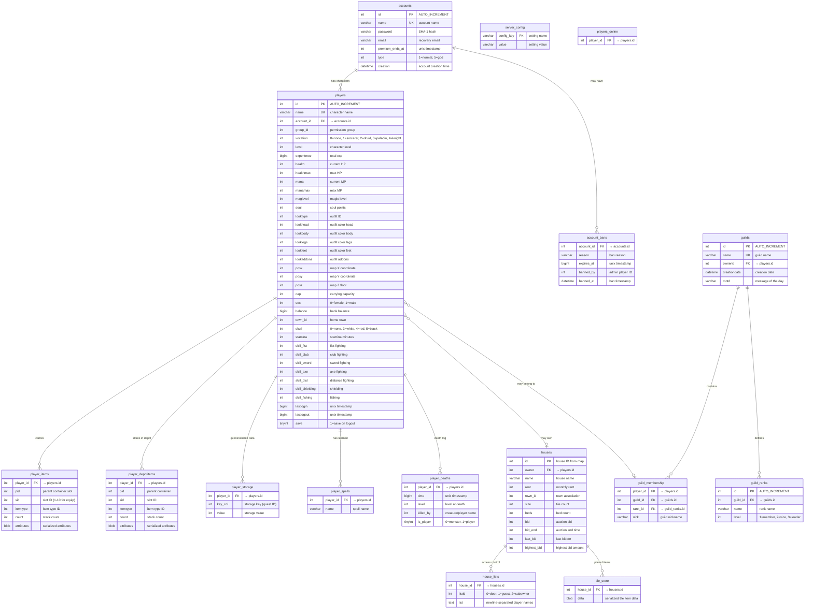
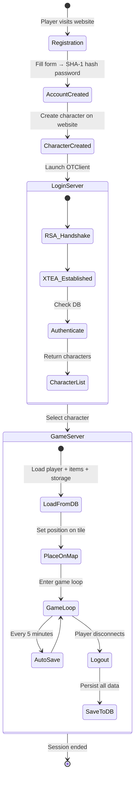
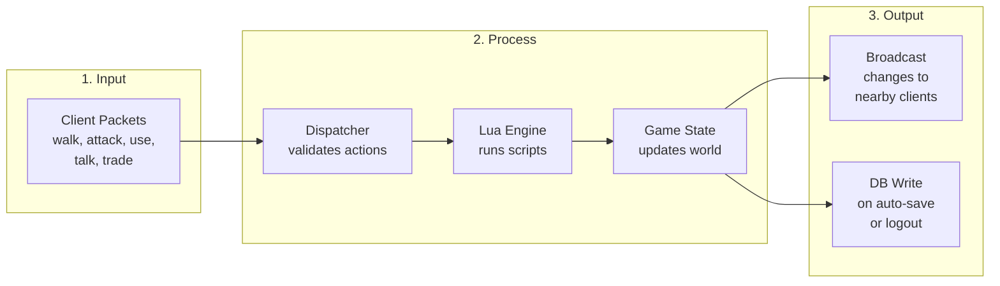

# Architecture & Database Design

> **SDLC Stage 2: Design — Document 01**
> Database structure, table definitions, SQL schema, and complete information flow

---

## 1. Database Schema Overview



---

## 2. Complete SQL Schema

```sql
-- ============================================================
-- Adventure OTS — Database Schema
-- Engine: MariaDB 10.11 / MySQL 8.0
-- Protocol: TFS 1.4.2 (Tibia 10.98)
-- ============================================================

CREATE DATABASE IF NOT EXISTS `adventureots`
  CHARACTER SET utf8mb4
  COLLATE utf8mb4_unicode_ci;

USE `adventureots`;

-- ------------------------------------------------------------
-- 1. ACCOUNTS
-- ------------------------------------------------------------
CREATE TABLE `accounts` (
  `id`               INT UNSIGNED     NOT NULL AUTO_INCREMENT,
  `name`             VARCHAR(32)      NOT NULL,
  `password`         CHAR(40)         NOT NULL COMMENT 'SHA-1 hash',
  `email`            VARCHAR(255)     NOT NULL DEFAULT '',
  `premdays`         INT UNSIGNED     NOT NULL DEFAULT 0,
  `lastday`          INT UNSIGNED     NOT NULL DEFAULT 0,
  `type`             TINYINT UNSIGNED NOT NULL DEFAULT 1 COMMENT '1=normal, 5=god',
  `creation`         INT UNSIGNED     NOT NULL DEFAULT 0,
  PRIMARY KEY (`id`),
  UNIQUE KEY `name` (`name`)
) ENGINE=InnoDB;

-- ------------------------------------------------------------
-- 2. PLAYERS
-- ------------------------------------------------------------
CREATE TABLE `players` (
  `id`               INT UNSIGNED     NOT NULL AUTO_INCREMENT,
  `name`             VARCHAR(255)     NOT NULL,
  `group_id`         INT UNSIGNED     NOT NULL DEFAULT 1,
  `account_id`       INT UNSIGNED     NOT NULL,
  `level`            INT UNSIGNED     NOT NULL DEFAULT 1,
  `vocation`         TINYINT UNSIGNED NOT NULL DEFAULT 0
                       COMMENT '0=none, 1=sorc, 2=druid, 3=paladin, 4=knight, 5-8=promos',
  `health`           INT              NOT NULL DEFAULT 150,
  `healthmax`        INT              NOT NULL DEFAULT 150,
  `experience`       BIGINT UNSIGNED  NOT NULL DEFAULT 0,
  `lookbody`         TINYINT UNSIGNED NOT NULL DEFAULT 0,
  `lookfeet`         TINYINT UNSIGNED NOT NULL DEFAULT 0,
  `lookhead`         TINYINT UNSIGNED NOT NULL DEFAULT 0,
  `looklegs`         TINYINT UNSIGNED NOT NULL DEFAULT 0,
  `looktype`         INT UNSIGNED     NOT NULL DEFAULT 136,
  `lookaddons`       TINYINT UNSIGNED NOT NULL DEFAULT 0,
  `maglevel`         INT UNSIGNED     NOT NULL DEFAULT 0,
  `mana`             INT              NOT NULL DEFAULT 0,
  `manamax`          INT              NOT NULL DEFAULT 0,
  `manaspent`        BIGINT UNSIGNED  NOT NULL DEFAULT 0,
  `soul`             TINYINT UNSIGNED NOT NULL DEFAULT 0,
  `town_id`          INT UNSIGNED     NOT NULL DEFAULT 1,
  `posx`             INT              NOT NULL DEFAULT 0,
  `posy`             INT              NOT NULL DEFAULT 0,
  `posz`             INT              NOT NULL DEFAULT 0,
  `cap`              INT              NOT NULL DEFAULT 400,
  `sex`              TINYINT UNSIGNED NOT NULL DEFAULT 0,
  `lastlogin`        BIGINT UNSIGNED  NOT NULL DEFAULT 0,
  `lastlogout`       BIGINT UNSIGNED  NOT NULL DEFAULT 0,
  `lastip`           INT UNSIGNED     NOT NULL DEFAULT 0,
  `save`             TINYINT          NOT NULL DEFAULT 1,
  `skull`            TINYINT          NOT NULL DEFAULT 0,
  `skulltime`        BIGINT           NOT NULL DEFAULT 0,
  `balance`          BIGINT UNSIGNED  NOT NULL DEFAULT 0,
  `stamina`          SMALLINT UNSIGNED NOT NULL DEFAULT 2520,
  `skill_fist`       INT UNSIGNED     NOT NULL DEFAULT 10,
  `skill_fist_tries` BIGINT UNSIGNED  NOT NULL DEFAULT 0,
  `skill_club`       INT UNSIGNED     NOT NULL DEFAULT 10,
  `skill_club_tries` BIGINT UNSIGNED  NOT NULL DEFAULT 0,
  `skill_sword`      INT UNSIGNED     NOT NULL DEFAULT 10,
  `skill_sword_tries` BIGINT UNSIGNED NOT NULL DEFAULT 0,
  `skill_axe`        INT UNSIGNED     NOT NULL DEFAULT 10,
  `skill_axe_tries`  BIGINT UNSIGNED  NOT NULL DEFAULT 0,
  `skill_dist`       INT UNSIGNED     NOT NULL DEFAULT 10,
  `skill_dist_tries` BIGINT UNSIGNED  NOT NULL DEFAULT 0,
  `skill_shielding`  INT UNSIGNED     NOT NULL DEFAULT 10,
  `skill_shielding_tries` BIGINT UNSIGNED NOT NULL DEFAULT 0,
  `skill_fishing`    INT UNSIGNED     NOT NULL DEFAULT 10,
  `skill_fishing_tries` BIGINT UNSIGNED NOT NULL DEFAULT 0,
  `direction`        TINYINT UNSIGNED NOT NULL DEFAULT 2,
  `loss_experience`  INT              NOT NULL DEFAULT 100,
  `loss_mana`        INT              NOT NULL DEFAULT 100,
  `loss_skills`      INT              NOT NULL DEFAULT 100,
  PRIMARY KEY (`id`),
  UNIQUE KEY `name` (`name`),
  KEY `account_id` (`account_id`),
  KEY `vocation` (`vocation`),
  CONSTRAINT `fk_players_account`
    FOREIGN KEY (`account_id`) REFERENCES `accounts` (`id`)
    ON DELETE CASCADE
) ENGINE=InnoDB;

-- ------------------------------------------------------------
-- 3. PLAYER ITEMS (inventory + equipment)
-- ------------------------------------------------------------
CREATE TABLE `player_items` (
  `player_id`  INT UNSIGNED     NOT NULL,
  `pid`        INT UNSIGNED     NOT NULL DEFAULT 0 COMMENT 'parent slot/container',
  `sid`        INT UNSIGNED     NOT NULL DEFAULT 0 COMMENT 'slot: 1-10=equip slots',
  `itemtype`   INT UNSIGNED     NOT NULL,
  `count`      SMALLINT UNSIGNED NOT NULL DEFAULT 0,
  `attributes` BLOB             NOT NULL,
  KEY `player_id` (`player_id`),
  CONSTRAINT `fk_pitems_player`
    FOREIGN KEY (`player_id`) REFERENCES `players` (`id`)
    ON DELETE CASCADE
) ENGINE=InnoDB;

-- ------------------------------------------------------------
-- 4. PLAYER DEPOT ITEMS (town depot storage)
-- ------------------------------------------------------------
CREATE TABLE `player_depotitems` (
  `player_id`  INT UNSIGNED     NOT NULL,
  `pid`        INT UNSIGNED     NOT NULL DEFAULT 0,
  `sid`        INT UNSIGNED     NOT NULL DEFAULT 0,
  `itemtype`   INT UNSIGNED     NOT NULL,
  `count`      SMALLINT UNSIGNED NOT NULL DEFAULT 0,
  `attributes` BLOB             NOT NULL,
  KEY `player_id` (`player_id`),
  CONSTRAINT `fk_pdepot_player`
    FOREIGN KEY (`player_id`) REFERENCES `players` (`id`)
    ON DELETE CASCADE
) ENGINE=InnoDB;

-- ------------------------------------------------------------
-- 5. PLAYER STORAGE (quest progress, variables)
-- ------------------------------------------------------------
CREATE TABLE `player_storage` (
  `player_id`  INT UNSIGNED NOT NULL,
  `key`        INT UNSIGNED NOT NULL,
  `value`      INT          NOT NULL DEFAULT 0,
  PRIMARY KEY (`player_id`, `key`),
  CONSTRAINT `fk_pstorage_player`
    FOREIGN KEY (`player_id`) REFERENCES `players` (`id`)
    ON DELETE CASCADE
) ENGINE=InnoDB;

-- ------------------------------------------------------------
-- 6. PLAYER SPELLS (learned spells)
-- ------------------------------------------------------------
CREATE TABLE `player_spells` (
  `player_id`  INT UNSIGNED NOT NULL,
  `name`       VARCHAR(255) NOT NULL,
  KEY `player_id` (`player_id`),
  CONSTRAINT `fk_pspells_player`
    FOREIGN KEY (`player_id`) REFERENCES `players` (`id`)
    ON DELETE CASCADE
) ENGINE=InnoDB;

-- ------------------------------------------------------------
-- 7. PLAYER DEATHS (death log)
-- ------------------------------------------------------------
CREATE TABLE `player_deaths` (
  `player_id`    INT UNSIGNED    NOT NULL,
  `time`         BIGINT UNSIGNED NOT NULL DEFAULT 0,
  `level`        INT UNSIGNED    NOT NULL DEFAULT 1,
  `killed_by`    VARCHAR(255)    NOT NULL,
  `is_player`    TINYINT         NOT NULL DEFAULT 1,
  `mostdamage_by` VARCHAR(100)   NOT NULL DEFAULT '',
  `mostdamage_is_player` TINYINT NOT NULL DEFAULT 0,
  `unjustified`  TINYINT         NOT NULL DEFAULT 0,
  `mostdamage_unjustified` TINYINT NOT NULL DEFAULT 0,
  KEY `player_id` (`player_id`),
  KEY `killed_by` (`killed_by`),
  CONSTRAINT `fk_pdeaths_player`
    FOREIGN KEY (`player_id`) REFERENCES `players` (`id`)
    ON DELETE CASCADE
) ENGINE=InnoDB;

-- ------------------------------------------------------------
-- 8. HOUSES
-- ------------------------------------------------------------
CREATE TABLE `houses` (
  `id`           INT UNSIGNED NOT NULL,
  `owner`        INT UNSIGNED NOT NULL DEFAULT 0,
  `paid`         INT UNSIGNED NOT NULL DEFAULT 0,
  `warnings`     INT UNSIGNED NOT NULL DEFAULT 0,
  `name`         VARCHAR(255) NOT NULL,
  `rent`         INT UNSIGNED NOT NULL DEFAULT 0,
  `town_id`      INT UNSIGNED NOT NULL DEFAULT 0,
  `bid`          INT UNSIGNED NOT NULL DEFAULT 0,
  `bid_end`      INT UNSIGNED NOT NULL DEFAULT 0,
  `last_bid`     INT UNSIGNED NOT NULL DEFAULT 0,
  `highest_bidder` INT UNSIGNED NOT NULL DEFAULT 0,
  `size`         INT UNSIGNED NOT NULL DEFAULT 0,
  `beds`         INT UNSIGNED NOT NULL DEFAULT 0,
  PRIMARY KEY (`id`),
  KEY `owner` (`owner`),
  KEY `town_id` (`town_id`)
) ENGINE=InnoDB;

-- ------------------------------------------------------------
-- 9. HOUSE LISTS (access control)
-- ------------------------------------------------------------
CREATE TABLE `house_lists` (
  `house_id` INT UNSIGNED NOT NULL,
  `listid`   TINYINT      NOT NULL DEFAULT 0
               COMMENT '0=door, 1=guest, 2=subowner',
  `list`     TEXT          NOT NULL,
  KEY `house_id` (`house_id`),
  CONSTRAINT `fk_hlists_house`
    FOREIGN KEY (`house_id`) REFERENCES `houses` (`id`)
    ON DELETE CASCADE
) ENGINE=InnoDB;

-- ------------------------------------------------------------
-- 10. TILE STORE (house items on tiles)
-- ------------------------------------------------------------
CREATE TABLE `tile_store` (
  `house_id` INT UNSIGNED NOT NULL,
  `data`     LONGBLOB     NOT NULL,
  KEY `house_id` (`house_id`),
  CONSTRAINT `fk_tstore_house`
    FOREIGN KEY (`house_id`) REFERENCES `houses` (`id`)
    ON DELETE CASCADE
) ENGINE=InnoDB;

-- ------------------------------------------------------------
-- 11. GUILDS
-- ------------------------------------------------------------
CREATE TABLE `guilds` (
  `id`           INT UNSIGNED NOT NULL AUTO_INCREMENT,
  `name`         VARCHAR(255) NOT NULL,
  `ownerid`      INT UNSIGNED NOT NULL,
  `creationdata` INT UNSIGNED NOT NULL,
  `motd`         VARCHAR(255) NOT NULL DEFAULT '',
  PRIMARY KEY (`id`),
  UNIQUE KEY `name` (`name`),
  KEY `ownerid` (`ownerid`),
  CONSTRAINT `fk_guilds_owner`
    FOREIGN KEY (`ownerid`) REFERENCES `players` (`id`)
    ON DELETE CASCADE
) ENGINE=InnoDB;

-- ------------------------------------------------------------
-- 12. GUILD RANKS
-- ------------------------------------------------------------
CREATE TABLE `guild_ranks` (
  `id`       INT UNSIGNED NOT NULL AUTO_INCREMENT,
  `guild_id` INT UNSIGNED NOT NULL,
  `name`     VARCHAR(255) NOT NULL,
  `level`    TINYINT UNSIGNED NOT NULL
               COMMENT '1=member, 2=vice, 3=leader',
  PRIMARY KEY (`id`),
  KEY `guild_id` (`guild_id`),
  CONSTRAINT `fk_granks_guild`
    FOREIGN KEY (`guild_id`) REFERENCES `guilds` (`id`)
    ON DELETE CASCADE
) ENGINE=InnoDB;

-- ------------------------------------------------------------
-- 13. GUILD MEMBERSHIP
-- ------------------------------------------------------------
CREATE TABLE `guild_membership` (
  `player_id` INT UNSIGNED NOT NULL,
  `guild_id`  INT UNSIGNED NOT NULL,
  `rank_id`   INT UNSIGNED NOT NULL,
  `nick`      VARCHAR(15)  NOT NULL DEFAULT '',
  PRIMARY KEY (`player_id`),
  KEY `guild_id` (`guild_id`),
  KEY `rank_id` (`rank_id`),
  CONSTRAINT `fk_gmemb_player`
    FOREIGN KEY (`player_id`) REFERENCES `players` (`id`)
    ON DELETE CASCADE,
  CONSTRAINT `fk_gmemb_guild`
    FOREIGN KEY (`guild_id`) REFERENCES `guilds` (`id`)
    ON DELETE CASCADE,
  CONSTRAINT `fk_gmemb_rank`
    FOREIGN KEY (`rank_id`) REFERENCES `guild_ranks` (`id`)
    ON DELETE CASCADE
) ENGINE=InnoDB;

-- ------------------------------------------------------------
-- 14. ACCOUNT BANS
-- ------------------------------------------------------------
CREATE TABLE `account_bans` (
  `account_id` INT UNSIGNED    NOT NULL,
  `reason`     VARCHAR(255)    NOT NULL DEFAULT '',
  `banned_at`  BIGINT UNSIGNED NOT NULL,
  `expires_at` BIGINT UNSIGNED NOT NULL,
  `banned_by`  INT UNSIGNED    NOT NULL,
  PRIMARY KEY (`account_id`),
  CONSTRAINT `fk_abans_account`
    FOREIGN KEY (`account_id`) REFERENCES `accounts` (`id`)
    ON DELETE CASCADE,
  CONSTRAINT `fk_abans_bannedby`
    FOREIGN KEY (`banned_by`) REFERENCES `players` (`id`)
    ON DELETE CASCADE
) ENGINE=InnoDB;

-- ------------------------------------------------------------
-- 15. IP BANS
-- ------------------------------------------------------------
CREATE TABLE `ip_bans` (
  `ip`         INT UNSIGNED    NOT NULL,
  `reason`     VARCHAR(255)    NOT NULL DEFAULT '',
  `banned_at`  BIGINT UNSIGNED NOT NULL,
  `expires_at` BIGINT UNSIGNED NOT NULL,
  `banned_by`  INT UNSIGNED    NOT NULL,
  PRIMARY KEY (`ip`),
  CONSTRAINT `fk_ipbans_bannedby`
    FOREIGN KEY (`banned_by`) REFERENCES `players` (`id`)
    ON DELETE CASCADE
) ENGINE=InnoDB;

-- ------------------------------------------------------------
-- 16. PLAYERS ONLINE (runtime tracking)
-- ------------------------------------------------------------
CREATE TABLE `players_online` (
  `player_id` INT UNSIGNED NOT NULL,
  PRIMARY KEY (`player_id`)
) ENGINE=MEMORY;

-- ------------------------------------------------------------
-- 17. SERVER CONFIG (key-value store)
-- ------------------------------------------------------------
CREATE TABLE `server_config` (
  `config`  VARCHAR(50) NOT NULL,
  `value`   VARCHAR(256) NOT NULL DEFAULT '',
  PRIMARY KEY (`config`)
) ENGINE=InnoDB;

-- Insert default server config
INSERT INTO `server_config` (`config`, `value`) VALUES
  ('db_version', '1'),
  ('motd_hash', ''),
  ('motd_num', '0'),
  ('players_record', '0');

-- ------------------------------------------------------------
-- 18. MARKET OFFERS (optional — future)
-- ------------------------------------------------------------
CREATE TABLE `market_offers` (
  `id`         INT UNSIGNED    NOT NULL AUTO_INCREMENT,
  `player_id`  INT UNSIGNED    NOT NULL,
  `sale`       TINYINT         NOT NULL DEFAULT 0 COMMENT '0=buy, 1=sell',
  `itemtype`   INT UNSIGNED    NOT NULL,
  `amount`     SMALLINT UNSIGNED NOT NULL,
  `price`      INT UNSIGNED    NOT NULL DEFAULT 0,
  `created`    BIGINT UNSIGNED NOT NULL,
  `anonymous`  TINYINT         NOT NULL DEFAULT 0,
  PRIMARY KEY (`id`),
  KEY `player_id` (`player_id`),
  KEY `sale` (`sale`, `itemtype`),
  CONSTRAINT `fk_market_player`
    FOREIGN KEY (`player_id`) REFERENCES `players` (`id`)
    ON DELETE CASCADE
) ENGINE=InnoDB;
```

---

## 3. Information Flow Diagrams

### 3.1 Player Lifecycle — Data Flow



### 3.2 Read/Write Matrix — Who Touches What

| Table | TFS Server | MyAAC Website | Admin Panel |
|-------|-----------|---------------|-------------|
| `accounts` | Read (login) | **Read/Write** (register, edit) | Read/Write |
| `players` | **Read/Write** (full lifecycle) | Read/Write (create, view) | Read/Write |
| `player_items` | **Read/Write** (game) | Read only (view) | Read |
| `player_depotitems` | **Read/Write** (game) | — | Read |
| `player_storage` | **Read/Write** (quests) | Read only (quest status) | Read |
| `player_spells` | **Read/Write** (learn/use) | Read only | Read |
| `player_deaths` | **Write** (on death) | Read only (death log) | Read |
| `houses` | **Read/Write** (ownership) | Read only (house list) | Read/Write |
| `guilds` | Read/Write | **Read/Write** | Read/Write |
| `guild_membership` | Read/Write | **Read/Write** | Read/Write |
| `account_bans` | Read (login check) | — | **Read/Write** |
| `players_online` | **Read/Write** (runtime) | Read only (who's online) | Read |
| `server_config` | **Read/Write** | Read only | Read/Write |
| `market_offers` | **Read/Write** | Read only | Read |

### 3.3 Game Loop Data Flow (Per Tick)



### 3.4 Configuration File Flow

```
config.lua ─────────────┐
  │                      │
  ├─ serverName          │
  ├─ ip / port           ├──► TFS reads at startup
  ├─ mysqlHost/Port/DB   │
  ├─ rateExp / rateLoot  │
  ├─ worldType (PvP)     │
  └─ mapName ────────────┘
                         │
data/                    │
  ├─ items/items.xml ────┼──► Loaded into memory
  ├─ monster/*.xml ──────┤
  ├─ npc/*.xml ──────────┤
  ├─ world/map.otbm ─────┤
  └─ scripts/*.lua ──────┘
```

---

## 4. Index Design & Query Patterns

### Key Indexes

| Table | Index | Columns | Query Pattern |
|-------|-------|---------|--------------|
| `accounts` | PK | `id` | Login by ID |
| `accounts` | UK | `name` | Login by name (most common) |
| `players` | PK | `id` | Load character |
| `players` | UK | `name` | Find by name (chat, trade) |
| `players` | IDX | `account_id` | List characters for account |
| `player_items` | IDX | `player_id` | Load inventory |
| `player_storage` | PK | `(player_id, key)` | Quest check (exact key lookup) |
| `player_deaths` | IDX | `player_id` | Death log |
| `houses` | IDX | `owner` | Find player's house |
| `guilds` | UK | `name` | Find guild by name |
| `players_online` | PK | `player_id` | Online check (MEMORY engine) |

### Common Queries

```sql
-- Login: find account
SELECT * FROM accounts WHERE name = ? LIMIT 1;

-- Character list for account
SELECT id, name, level, vocation, town_id FROM players 
WHERE account_id = ? ORDER BY name;

-- Load character (full)
SELECT * FROM players WHERE id = ?;

-- Load inventory
SELECT * FROM player_items WHERE player_id = ? ORDER BY sid;

-- Save character (update)
UPDATE players SET level=?, experience=?, health=?, healthmax=?,
  mana=?, manamax=?, maglevel=?, posx=?, posy=?, posz=?,
  cap=?, stamina=?, balance=?, lastlogout=UNIX_TIMESTAMP()
WHERE id = ?;

-- Highscores (website)
SELECT name, level, vocation, experience FROM players
WHERE group_id < 2 ORDER BY experience DESC LIMIT 50;

-- Online players (website)
SELECT p.name, p.level, p.vocation FROM players_online po
JOIN players p ON po.player_id = p.id;
```

---

## 5. Docker Compose Blueprint

```yaml
# docker-compose.yml — Adventure OTS
version: '3.8'

services:
  # ── Game Server ──────────────────────────────
  gameserver:
    build:
      context: ./server
      dockerfile: Dockerfile
    container_name: adventure-tfs
    restart: unless-stopped
    ports:
      - "7171:7171"    # Login server
      - "7172:7172"    # Game server
    volumes:
      - ./data:/srv/data            # Lua scripts, monsters, NPCs
      - ./config/config.lua:/srv/config.lua
      - ./data/world:/srv/data/world  # Map file
    environment:
      - MYSQL_HOST=database
      - MYSQL_PORT=3306
      - MYSQL_DB=${DB_NAME}
      - MYSQL_USER=${DB_USER}
      - MYSQL_PASS=${DB_PASSWORD}
    depends_on:
      database:
        condition: service_healthy
    networks:
      - otsnet

  # ── Database ─────────────────────────────────
  database:
    image: mariadb:10.11
    container_name: adventure-db
    restart: unless-stopped
    environment:
      MYSQL_ROOT_PASSWORD: ${DB_ROOT_PASSWORD}
      MYSQL_DATABASE: ${DB_NAME}
      MYSQL_USER: ${DB_USER}
      MYSQL_PASSWORD: ${DB_PASSWORD}
    volumes:
      - db_data:/var/lib/mysql
      - ./sql/schema.sql:/docker-entrypoint-initdb.d/01-schema.sql
    healthcheck:
      test: ["CMD", "healthcheck.sh", "--connect", "--innodb_initialized"]
      interval: 10s
      timeout: 5s
      retries: 3
    networks:
      - otsnet

  # ── Website (AAC) ───────────────────────────
  webpanel:
    build:
      context: ./web
      dockerfile: Dockerfile
    container_name: adventure-web
    restart: unless-stopped
    ports:
      - "80:80"
      - "443:443"
    volumes:
      - ./web/config.php:/var/www/html/config.php
    environment:
      - DB_HOST=database
      - DB_NAME=${DB_NAME}
      - DB_USER=${DB_USER}
      - DB_PASS=${DB_PASSWORD}
    depends_on:
      database:
        condition: service_healthy
    networks:
      - otsnet

  # ── Backup Service ──────────────────────────
  backup:
    image: databack/mysql-backup
    container_name: adventure-backup
    restart: unless-stopped
    environment:
      - DB_SERVER=database
      - DB_USER=root
      - DB_PASS=${DB_ROOT_PASSWORD}
      - DB_DUMP_TARGET=/backup
      - DB_DUMP_FREQ=1440      # daily (minutes)
      - DB_DUMP_KEEP=7         # keep last 7
    volumes:
      - ./backups:/backup
    depends_on:
      - database
    networks:
      - otsnet

volumes:
  db_data:
    driver: local

networks:
  otsnet:
    driver: bridge
```

---

## 6. Directory Structure Blueprint

```
adventureots/
├── docker-compose.yml
├── .env                          # DB passwords, server config
├── .env.example
│
├── server/                       # TFS build context
│   ├── Dockerfile
│   └── (TFS source — cloned at build)
│
├── config/
│   └── config.lua                # Server configuration
│
├── data/                         # Game data (mounted into TFS)
│   ├── items/
│   │   ├── items.otb
│   │   └── items.xml
│   ├── monster/
│   │   ├── monsters.xml
│   │   └── *.xml (per creature)
│   ├── npc/
│   │   └── *.xml
│   ├── scripts/
│   │   ├── actions/
│   │   ├── creaturescripts/
│   │   ├── globalevents/
│   │   ├── movements/
│   │   ├── spells/
│   │   ├── talkactions/
│   │   └── quests/ (custom)
│   ├── world/
│   │   ├── map.otbm
│   │   ├── map-spawns.xml
│   │   └── map-houses.xml
│   └── XML/
│       ├── vocations.xml
│       ├── groups.xml
│       ├── stages.xml
│       └── outfits.xml
│
├── sql/
│   └── schema.sql                # Initial DB schema
│
├── web/                          # MyAAC build context
│   ├── Dockerfile
│   └── config.php
│
├── backups/                      # Auto-generated DB dumps
│
├── client/                       # OTClient distribution
│   ├── otclient.exe
│   ├── data/
│   │   ├── Tibia.dat
│   │   └── Tibia.spr
│   └── modules/ (custom UI)
│
└── docs/                         # Project documentation
```
