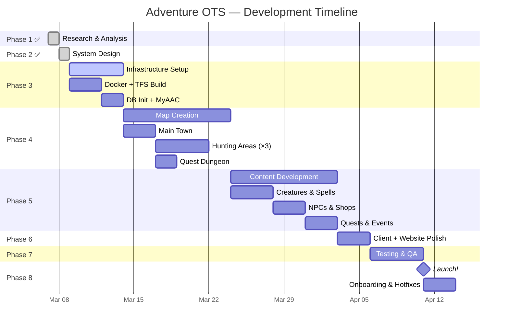

# Schedule & Product Backlog

> **SDLC Stage 2: Design — Document 03**
> MVP definition, full product backlog, sprint breakdown, and priorities

---

## 1. MVP Definition — What Must Be Ready for Launch

> The MVP (Minimum Viable Product) is the smallest version of the server that delivers a **playable, enjoyable Tibia experience** for friends.

### MVP Includes (Launch Blockers)

| Area | What's Included | What's NOT Included |
|------|----------------|---------------------|
| **Server** | TFS running in Docker, stable for 24h | Custom C++ mods |
| **Database** | Schema initialized, accounts + player data working | Market/auction tables |
| **Login** | Account registration → login → enter game | 2FA, premium system |
| **Map** | 1 town, 3 hunting areas, 1 quest area (~200×200 tiles) | Multiple towns, full continent |
| **Vocations** | All 4 base vocations functional | Promoted vocations |
| **Creatures** | 15–20 creature types (rats → dragons) | 100+ creature types |
| **Spells** | Core spells per vocation (heal, attack, haste) | All 100+ spells |
| **NPCs** | 5–8 essential NPCs (shop, spell, quest, bank) | Dozens of NPCs |
| **Quests** | 1–2 simple quests (kill X, find item) | Multi-step quest chains |
| **Items** | Standard weapons, armor, potions | Rare/unique items |
| **Combat** | PvE works, basic PvP | Skull system, war system |
| **Chat** | Default channel, private messages | All channels, admin broadcast |
| **Website** | Register, login, character create, server info | Highscores, guild page, news editor |
| **Client** | OTClient V8 configured and distributable | Custom branding, modules |
| **Backup** | Auto-save + daily DB dump | Offsite replication |

### MVP Excludes (Post-Launch)

- Housing system
- Guild system
- Market / auction house
- Premium accounts
- Multiple towns
- Promoted vocations (5–8)
- Raid system
- Advanced admin panel
- Quest log UI
- Day/night cycle

---

## 2. Product Backlog

> All work items, ordered by priority. Each item is tagged with **MoSCoW** priority and assigned to a phase.

### Epic 1: Infrastructure Setup

| # | Task | Priority | Phase | Est. Hours | Depends On |
|---|------|----------|-------|-----------|------------|
| 1.1 | Create `docker-compose.yml` with TFS, MariaDB, MyAAC, backup | Must | P3 | 4h | — |
| 1.2 | Write TFS `Dockerfile` (compile from source) | Must | P3 | 4h | — |
| 1.3 | Create `.env` file with DB credentials | Must | P3 | 0.5h | — |
| 1.4 | Initialize MariaDB with `schema.sql` | Must | P3 | 1h | 1.1 |
| 1.5 | Configure `config.lua` (server name, rates, PvP type, DB) | Must | P3 | 2h | 1.2 |
| 1.6 | Build and test TFS container (starts without errors) | Must | P3 | 3h | 1.2, 1.4 |
| 1.7 | Write MyAAC `Dockerfile` (PHP + Nginx) | Must | P3 | 3h | — |
| 1.8 | Deploy MyAAC and verify account registration | Must | P3 | 2h | 1.7, 1.4 |
| 1.9 | Set up automated daily DB backup | Should | P3 | 1h | 1.1 |
| 1.10 | Configure firewall rules (ports 7171, 7172, 80) | Must | P3 | 1h | 1.6 |
| 1.11 | Set up Git repo with `.gitignore` for data/configs | Must | P3 | 0.5h | — |
| | | | | **~22h** | |

---

### Epic 2: Map Creation

| # | Task | Priority | Phase | Est. Hours | Depends On |
|---|------|----------|-------|-----------|------------|
| 2.1 | Install and configure Remere's Map Editor (RME) | Must | P4 | 1h | — |
| 2.2 | Design town layout (sketch on paper/draw.io) | Must | P4 | 2h | — |
| 2.3 | Build main town in RME (temple, depot, shops, houses) | Must | P4 | 8h | 2.1 |
| 2.4 | Create hunting area 1: Beginner (Lv 1–20, rats, bugs, snakes) | Must | P4 | 4h | 2.3 |
| 2.5 | Create hunting area 2: Intermediate (Lv 20–50, orcs, minotaurs) | Must | P4 | 5h | 2.3 |
| 2.6 | Create hunting area 3: Advanced (Lv 50–80, dragons, demons) | Must | P4 | 5h | 2.3 |
| 2.7 | Create quest dungeon (1 quest with boss room) | Must | P4 | 4h | 2.3 |
| 2.8 | Place spawn points for all creatures | Must | P4 | 3h | 2.4–2.6 |
| 2.9 | Place NPC positions in town | Must | P4 | 1h | 2.3 |
| 2.10 | Export map as `.otbm` + spawns/houses XML | Must | P4 | 0.5h | all above |
| 2.11 | Create second town (post-MVP) | Should | P4+ | 8h | 2.10 |
| 2.12 | Create 2 more hunting areas (post-MVP) | Should | P4+ | 8h | 2.11 |
| | | | | **~34h (MVP)** / 50h (full) | |

---

### Epic 3: Game Content (Lua Scripts)

| # | Task | Priority | Phase | Est. Hours | Depends On |
|---|------|----------|-------|-----------|------------|
| 3.1 | Configure `vocations.xml` (Knight, Paladin, Sorc, Druid) | Must | P5 | 2h | — |
| 3.2 | Create/configure 15–20 monster XMLs (stats, loot, behavior) | Must | P5 | 6h | — |
| 3.3 | Create core spell scripts (heal, haste, attack spells × 4 vocs) | Must | P5 | 4h | — |
| 3.4 | Create NPC: Weapon/armor shop merchant | Must | P5 | 2h | — |
| 3.5 | Create NPC: Potion/rune shop merchant | Must | P5 | 1.5h | — |
| 3.6 | Create NPC: Spell trainer (per vocation) | Must | P5 | 2h | — |
| 3.7 | Create NPC: Bank (deposit/withdraw gold) | Should | P5 | 1.5h | — |
| 3.8 | Create NPC: Quest giver | Must | P5 | 2h | — |
| 3.9 | Script Quest 1: Kill X creatures → reward | Must | P5 | 3h | 3.8 |
| 3.10 | Script Quest 2: Dungeon boss → rare item reward | Should | P5 | 4h | 2.7, 3.8 |
| 3.11 | Configure `stages.xml` (experience stages) | Must | P5 | 1h | — |
| 3.12 | Configure `groups.xml` (player, GM, GOD permissions) | Must | P5 | 0.5h | — |
| 3.13 | Create GM talkaction commands (!teleport, !kick, !ban) | Must | P5 | 2h | — |
| 3.14 | Create player talkaction commands (!online, !serverinfo) | Should | P5 | 1h | — |
| 3.15 | Create login/death creature scripts | Must | P5 | 1.5h | — |
| 3.16 | Create global event: Server save announcement | Should | P5 | 1h | — |
| 3.17 | Create 50+ creature types (post-MVP) | Should | P5+ | 12h | 3.2 |
| 3.18 | Create all vocation spells (post-MVP) | Should | P5+ | 8h | 3.3 |
| 3.19 | Create 5+ quests (post-MVP) | Should | P5+ | 15h | 3.9 |
| | | | | **~35h (MVP)** / 70h (full) | |

---

### Epic 4: Client Setup

| # | Task | Priority | Phase | Est. Hours | Depends On |
|---|------|----------|-------|-----------|------------|
| 4.1 | Download and extract OTClient V8 | Must | P6 | 0.5h | — |
| 4.2 | Copy matching `Tibia.dat` + `Tibia.spr` (protocol 10.98) | Must | P6 | 0.5h | — |
| 4.3 | Configure RSA keys (client ↔ server match) | Must | P6 | 1h | 1.6 |
| 4.4 | Set default server IP in client config | Must | P6 | 0.5h | 1.6 |
| 4.5 | Test client → server connection | Must | P6 | 1h | 1.6 |
| 4.6 | Package client as distributable ZIP (for friends) | Must | P6 | 0.5h | 4.5 |
| 4.7 | Write player setup guide (how to install and connect) | Must | P6 | 1h | 4.6 |
| 4.8 | Custom login screen branding (post-MVP) | Could | P6+ | 3h | — |
| 4.9 | Custom UI modules (post-MVP) | Could | P6+ | 8h | — |
| | | | | **~5h (MVP)** / 16h (full) | |

---

### Epic 5: Website (AAC)

| # | Task | Priority | Phase | Est. Hours | Depends On |
|---|------|----------|-------|-----------|------------|
| 5.1 | Deploy MyAAC (Docker container running) | Must | P3 | in 1.7–1.8 | — |
| 5.2 | Configure server name, rates, description | Must | P3 | 1h | 5.1 |
| 5.3 | Test account registration flow | Must | P3 | 1h | 5.1 |
| 5.4 | Test character creation flow | Must | P3 | 1h | 5.1 |
| 5.5 | Add server info page (rules, rates, download link) | Must | P6 | 1h | 5.1 |
| 5.6 | Customize template/theme (dark fantasy) | Should | P6 | 4h | 5.1 |
| 5.7 | Add highscores page | Should | P6+ | 1h | 5.1 |
| 5.8 | Add guild page | Could | P6+ | 2h | 5.1 |
| 5.9 | Admin panel configuration | Should | P3 | 1h | 5.1 |
| | | | | **~5h (MVP)** / 12h (full) | |

---

### Epic 6: Testing & QA

| # | Task | Priority | Phase | Est. Hours | Depends On |
|---|------|----------|-------|-----------|------------|
| 6.1 | Walk across entire map, check for tile errors | Must | P7 | 2h | E2 |
| 6.2 | Test all 4 vocations: spells, combat, leveling | Must | P7 | 3h | E3 |
| 6.3 | Test all NPCs: dialogue, buy/sell, quests | Must | P7 | 2h | E3 |
| 6.4 | Test PvP combat between two characters | Must | P7 | 1h | E3 |
| 6.5 | Test quest 1 end-to-end | Must | P7 | 1h | 3.9 |
| 6.6 | Test quest 2 end-to-end | Should | P7 | 1h | 3.10 |
| 6.7 | Test server restart + data persistence | Must | P7 | 1h | E1 |
| 6.8 | Test backup restore procedure | Must | P7 | 1h | 1.9 |
| 6.9 | Load test: 5 concurrent players | Must | P7 | 1h | E4 |
| 6.10 | Security check: SQL injection on website | Should | P7 | 1h | E5 |
| 6.11 | Fix all bugs found | Must | P7 | 4h | 6.1–6.10 |
| | | | | **~18h** | |

---

### Epic 7: Launch & Onboarding

| # | Task | Priority | Phase | Est. Hours | Depends On |
|---|------|----------|-------|-----------|------------|
| 7.1 | Deploy production (final docker-compose up) | Must | P8 | 1h | E6 |
| 7.2 | Create admin/god account | Must | P8 | 0.5h | 7.1 |
| 7.3 | Distribute client ZIP to friends | Must | P8 | 0.5h | 4.6 |
| 7.4 | Send setup instructions (Discord/WhatsApp) | Must | P8 | 0.5h | 4.7 |
| 7.5 | First play session with friends — gather feedback | Must | P8 | 2h | 7.3 |
| 7.6 | Hotfix session (fix critical bugs from feedback) | Must | P8 | 3h | 7.5 |
| | | | | **~7.5h** | |

---

## 3. Sprint / Phase Breakdown

---

## 4. Effort Summary

| Epic | MVP Hours | Full Hours | Phase |
|------|----------|-----------|-------|
| E1: Infrastructure | 22h | 22h | P3 |
| E2: Map Creation | 34h | 50h | P4 |
| E3: Content (Lua) | 35h | 70h | P5 |
| E4: Client Setup | 5h | 16h | P6 |
| E5: Website | 5h | 12h | P3 + P6 |
| E6: Testing & QA | 18h | 18h | P7 |
| E7: Launch | 7.5h | 7.5h | P8 |
| **TOTAL** | **~127h** | **~196h** | — |

### Working Time Estimates

| Schedule | Hours/Week | MVP Duration | Full Duration |
|----------|-----------|-------------|---------------|
| Hobby (5h/week) | 5h | ~6 months | ~10 months |
| Part-time (10h/week) | 10h | ~3 months | ~5 months |
| Focused (20h/week) | 20h | ~7 weeks | ~10 weeks |
| Sprint (40h/week) | 40h | ~3.5 weeks | ~5 weeks |

---

## 5. Priority Rules (MoSCoW)

| Priority | Rule | Count |
|----------|------|-------|
| **Must** | Server will not launch without this | ~42 tasks |
| **Should** | Launch is possible but experience is degraded | ~15 tasks |
| **Could** | Nice-to-have, planned for post-launch | ~8 tasks |
| **Won't** (Phase 1) | Explicitly excluded from MVP | Housing, guilds, raids, premium |

---

## 6. Definition of Done (DoD)

Each task is "done" when:

- [ ] Feature works as described in requirements
- [ ] No crashes or errors in server logs
- [ ] Tested manually at least once
- [ ] Data persists across server restart
- [ ] Committed to Git
